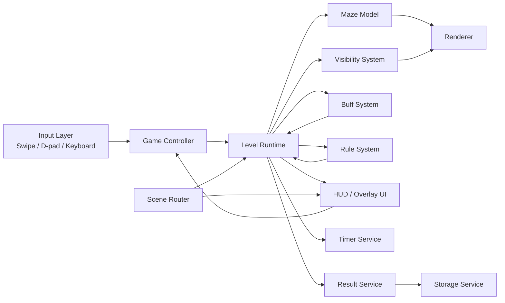
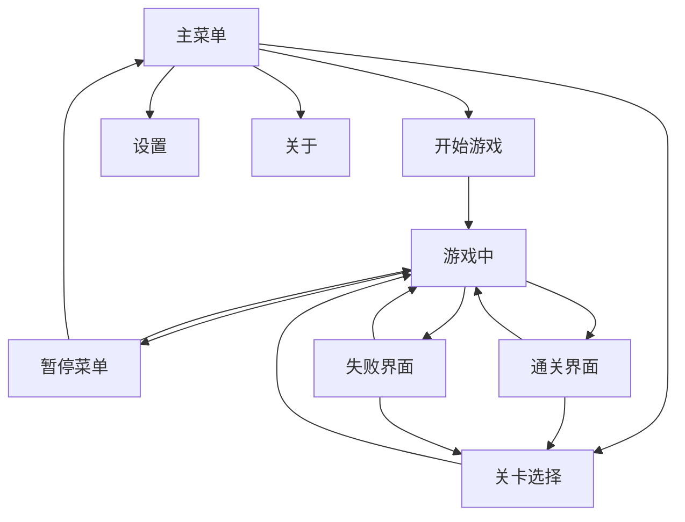

# 移动端 2D 迷宫游戏设计说明书

更新时间：2026-06-28

## 1. 项目目标

设计一款适用于移动端的 2D 网格迷宫游戏，满足以下核心目标：

1. 角色在迷宫中逐格移动，地图采用渐进式视野揭示。
2. 角色视野范围可配置，并支持 Buff 动态修改。
3. 提供 20 个难度递增的关卡。
4. 提供完整菜单系统、计时系统和通关结果反馈。
5. 架构上为 Buff、机关、特殊地块和后续关卡扩展预留接口。

## 2. 设计原则

1. 移动端优先：交互、信息密度、地图尺寸先服务触屏体验。
2. 轻量可维护：不在首版引入重型框架。
3. 模块化但不碎片化：核心业务流程保持清晰，系统边界明确。
4. 数据驱动：关卡、Buff、UI 配置均使用结构化数据描述。
5. 可验证：迷宫生成、关卡可达性、视野更新和结果结算均可单测。

## 3. 技术栈建议

推荐采用：

- `HTML5 Canvas`：地图与角色渲染
- `CSS3`：菜单、HUD、弹层、响应式布局
- `JavaScript ES Modules`：模块组织
- `Pointer Events`：触摸与鼠标统一输入
- `requestAnimationFrame`：主循环
- `localStorage`：设置、最佳时间、解锁状态持久化

暂不建议：

- Phaser
- React / Next.js
- Matter.js 等物理引擎

## 4. 系统架构

### 4.1 总体结构图



### 4.2 模块拆分

#### 核心模块

- `GameApp`
  - 应用入口
  - 初始化场景路由、资源、全局配置

- `SceneRouter`
  - 主菜单
  - 关卡选择
  - 游戏场景
  - 设置
  - 关于
  - 暂停弹层
  - 结果弹层

- `GameController`
  - 接收输入
  - 驱动角色移动
  - 触发视野更新、关卡规则和结算

#### 游戏模块

- `MazeModel`
  - 迷宫格子数据
  - 起点、终点、机关、地块、实体位置

- `LevelRuntime`
  - 当前关卡状态
  - 玩家状态
  - 计时状态
  - 胜负状态

- `VisibilitySystem`
  - 管理 `隐藏 / 已探索 / 当前可见`
  - 支持基础视野半径和 Buff 覆盖

- `BuffSystem`
  - 统一挂载临时效果
  - 提供生命周期、叠加规则、倒计时和事件通知

- `RuleSystem`
  - 门钥匙判定
  - 传送点
  - 减速地块
  - 限时关逻辑
  - 关卡目标完成判断

#### 表现层模块

- `CanvasRenderer`
  - 地图渲染
  - 角色渲染
  - 可见区域遮罩
  - 特效与过渡

- `HUDView`
  - 计时
  - 关卡名
  - Buff 状态
  - 暂停按钮

- `MenuView`
  - 主菜单
  - 设置
  - 关于
  - 关卡选择

#### 基础服务模块

- `StorageService`
  - 保存设置
  - 保存通关记录
  - 保存解锁进度

- `AudioService`
  - 按键音效
  - 移动音效
  - 成功/失败音效
  - 静音与音量

- `ConfigService`
  - 全局常量与默认配置

## 5. 项目目录建议

评审通过后建议按以下结构开发，以顶层 `MobileMazeGame/` 作为单一源目录：

```text
MobileMazeGame/
  README.md
  docs/
  data/
  src/
    index.html
    assets/
      audio/
      images/
    styles/
      base.css
      layout.css
      components.css
      mobile.css
    scripts/
      app/
        game-app.js
        scene-router.js
      core/
        event-bus.js
        config.js
        storage-service.js
        audio-service.js
      game/
        game-controller.js
        level-runtime.js
        maze-model.js
        visibility-system.js
        buff-system.js
        rule-system.js
      input/
        swipe-input.js
        dpad-input.js
        input-adapter.js
      render/
        canvas-renderer.js
        sprite-theme.js
      ui/
        hud-view.js
        menu-view.js
        result-view.js
      data/
        levels.js
        buff-definitions.js
        tile-definitions.js
```

## 6. 核心玩法设计

### 6.1 基础规则

1. 玩家在规则网格中进行四方向移动。
2. 每次输入最多移动 1 格，长按或连续滑动可触发队列移动。
3. 玩家目标通常为：
   - 到达终点；
   - 或收集关键物件后到达终点。
4. 地图初始为隐藏状态，仅显示起点周边可见区域。
5. 玩家移动后，重新计算视野，并保留已探索区域的暗显状态。

### 6.4 视野作为难度维度

视野设计不仅是表现机制，也应作为核心难度参数使用。

推荐难度递增方式：

1. 前期关卡使用较大视野半径，帮助玩家建立规则认知。
2. 中期逐步缩小视野半径，提升路径记忆和局部决策压力。
3. 后期在小视野基础上叠加障碍、机关和更复杂地图结构。

推荐节奏：

- `L01-L02`：视野半径 `4`
- `L03-L10`：视野半径 `3`
- `L11-L20`：视野半径 `2`

这样做的价值：

- 难度提升更自然，不需要一开始就把地图做得过大。
- 能让玩家先学会“看懂迷宫”，再学习“在不完整信息下决策”。
- 后期难度可以来自“低视野 + 机制组合 + 更强地图结构”，而不是单纯拉长路线。

### 6.2 失败与成功条件

成功条件：

- 到达终点，且满足关卡要求的前置条件。

失败条件：

- 限时关倒计时结束。
- 后续扩展型机关触发失败规则。

### 6.3 计时规则

- 玩家首次执行有效移动时开始计时。
- 暂停状态下计时冻结。
- 通关时记录本次完成时长、步数、是否刷新最佳成绩。

## 7. 视野系统设计

### 7.1 可见状态定义

每个格子维护 `visibilityState`：

- `hidden`：从未见过
- `explored`：曾经看见过，但当前不在视野内
- `visible`：当前可见

### 7.2 可配置参数

```js
{
  baseVisionRadius: 3,
  visionMode: "grid-raycast",
  rememberExploredTiles: true,
  fullMapRevealOnFinish: true
}
```

### 7.3 推荐算法

首版采用 `grid-raycast`：

1. 以玩家为中心取一个半径包围盒。
2. 对包围盒中的候选格子做离散射线检测。
3. 若射线路径被墙体阻挡，则该格不可见。
4. 若格子可见，则标记为 `visible`；上一帧可见但本帧不可见的格子降级为 `explored`。

这样可获得以下效果：

- 不会出现“穿墙看见后面区域”。
- 视野半径改动只影响算法参数，不影响上层业务。
- 后续可平滑替换为 shadowcasting。

### 7.4 视野扩展点

视野系统必须支持：

- 临时全图视野 Buff
- 临时扩大视野半径 Buff
- 特殊地块造成视野半径缩小
- 关卡级全局黑暗/明亮 modifier

## 8. Buff 系统设计

### 8.1 设计目标

Buff 系统首版不要求全部玩法上线，但接口必须先定型，支持未来无缝接入。

### 8.2 Buff 抽象

```js
{
  id: "full-map-vision",
  type: "vision",
  durationMs: 5000,
  stackMode: "refresh",
  modifiers: {
    revealAll: true
  }
}
```

### 8.3 首批预留 Buff 类型

1. `full-map-vision`
   - 全地图视野
   - 支持持续时间配置

2. `speed-boost`
   - 移动动画速度提升
   - 连续输入冷却缩短

3. `vision-boost`
   - 视野半径临时增加

4. `trap-immunity`
   - 预留
   - 未来可免疫减速/减视野地块

### 8.4 生命周期

- `onApply`
- `onTick`
- `onExpire`
- `onRemove`

### 8.5 叠加规则

- `refresh`：重复获得时刷新持续时间
- `stack`：数值叠加
- `replace`：强效果覆盖弱效果
- `ignore`：已存在时忽略

## 9. 关卡与地图设计

### 9.1 关卡构成

每关由以下几部分组成：

- 迷宫基础布局
- 起点与终点
- 特殊地块和机关
- 目标条件
- 视野配置
- 限时或无时限规则
- 推荐通关时长

### 9.2 迷宫生成策略

首版采用“参数化生成 + 设计校验 + 少量手工修饰”的混合方案：

1. 通过 `seed + generatorType + rule modifiers` 生成基础迷宫。
2. 注入关卡元素：
   - 钥匙门
   - 传送点
   - 信标
   - 减速地块
   - 单向门
   - 压力板
3. 使用 `BFS` 验证：
   - 起点到终点可达
   - 关键目标顺序可达
   - 路径长度达到目标难度阈值
4. 若不满足，则重新生成或使用备用 seed。

### 9.3 20 关设计总表

详细结构化数据见 `../data/level-plan.json`。

| 关卡 | 名称 | 网格 | 视野 | 核心机制 | 难度目标 |
|---|---|---:|---:|---|---|
| 1 | 晨光入口 | 9x9 | 4 | 教学，直达出口 | 熟悉移动与视野 |
| 2 | 双岔回廊 | 10x10 | 4 | 分岔和回头路 | 学会观察暗显区域 |
| 3 | 盲角小径 | 11x11 | 3 | 死胡同增加 | 强化路径记忆 |
| 4 | 低照地带 | 11x13 | 3 | 更低视野 | 适应紧凑探索 |
| 5 | 铜钥之门 | 12x12 | 3 | 钥匙门 | 目标前置条件 |
| 6 | 信标试炼 | 12x13 | 3 | 临时全图视野道具 | 验证 Buff 流程 |
| 7 | 泥沼边界 | 13x13 | 3 | 减速地块 | 触控节奏控制 |
| 8 | 镜面跃迁 | 13x14 | 3 | 单组传送门 | 空间重映射 |
| 9 | 单行岔口 | 14x14 | 3 | 单向门 | 减少试错容错 |
| 10 | 倒计时走廊 | 14x15 | 3 | 限时通关 | 引入失败界面 |
| 11 | 暗雾陷阱 | 15x15 | 2 | 降视野陷阱 | 对抗局部失明 |
| 12 | 双钥封锁 | 15x16 | 3 | 双钥匙双门 | 路径规划升级 |
| 13 | 隐线捷径 | 16x16 | 2 | 隐藏支路 | 奖励探索 |
| 14 | 压板回路 | 16x17 | 3 | 压力板开门 | 顺序型解法 |
| 15 | 余辉灯塔 | 17x17 | 2 | 多信标路径 | Buff 资源管理 |
| 16 | 跃迁串链 | 17x18 | 2 | 传送链 | 记忆与定位 |
| 17 | 黑核迷城 | 18x18 | 2 | 中央重黑区 | 高压探索 |
| 18 | 分流枢纽 | 18x19 | 2 | 多目标多路线 | 决策成本抬升 |
| 19 | 终幕前厅 | 19x19 | 2 | 复合机关 | 全机制混合 |
| 20 | 深渊主迷宫 | 20x20 | 2 | 终极综合关 | 最终挑战 |

### 9.4 关卡设计准则

1. 移动端单关时长控制在 `40 秒 - 180 秒` 为主。
2. 地图尺寸增长要与视野压缩同步，不能只靠放大地图提升难度。
3. 每 2 到 3 关只引入 1 个新机制，避免学习成本堆叠。
4. 后期难度优先来自“机制组合”，而不是纯路径长度膨胀。
5. 难度构成建议遵循：
   - 前期：大视野 + 小地图 + 低障碍
   - 中期：中视野 + 中地图 + 单机制
   - 后期：小视野 + 大地图 + 多机制叠加

## 10. 部署与打包设计

### 10.1 部署目标

该游戏应同时支持两种形态：

1. 作为当前游戏集合中的一个子游戏嵌入运行。
2. 作为独立项目单独打包为 App。

### 10.2 推荐方案

采用“单一源码，双入口壳层”结构。

核心原则：

- 游戏逻辑、关卡数据、渲染和 UI 代码只维护一份。
- 外层仅根据运行目标提供不同入口页、配置和打包壳。

推荐结构：

```text
MobileMazeGame/
  src/                  # 单一游戏源码
  standalone/           # 独立版入口资源
  embedded/             # 嵌入当前游戏合集的入口资源
```

### 10.3 嵌入当前项目

嵌入方式：

- 在当前仓库中保留一个入口目录，例如未来可导出到 `game-app/www/MobileMazeGame/`
- 由游戏集合首页跳转到该入口
- 入口页只负责加载同一套核心脚本和资源

### 10.4 独立 App 打包

独立打包方式建议：

1. `Web/PWA` 独立发布
2. `Cordova Android` 独立壳打包

其中：

- 若要最快落地，优先使用独立 `Cordova` 壳
- 若要更轻的发布方式，可同时支持 `PWA`

### 10.5 架构要求

为了支持“双形态部署”，需要在设计上遵守以下约束：

1. 禁止把业务逻辑写死到仓库首页或合集菜单里。
2. 资源路径使用相对路径或统一的 `basePath` 配置。
3. 返回主页、暂停、分享等能力通过 `HostAdapter` 注入，而不是写死实现。
4. 本地存档 key 要支持命名空间区分，避免和合集内其他游戏冲突。

### 10.6 HostAdapter 设计

```js
class HostAdapter {
  isEmbedded()
  getBasePath()
  exitToHost()
  onAppPause(callback)
  onAppResume(callback)
}
```

嵌入模式下：

- `exitToHost()` 返回游戏合集首页

独立模式下：

- `exitToHost()` 返回独立版主菜单或触发原生返回逻辑

### 10.7 推荐工程策略

推荐把 `MobileMazeGame/` 作为唯一开发源目录，然后产出：

1. 一个嵌入版构建产物，接入当前仓库
2. 一个独立版构建产物，用于单独打包 App

这样可以做到：

- 能嵌入当前项目
- 能独立打包
- 不会出现两套逻辑长期分叉

## 11. 数据结构设计

### 11.1 Cell

```js
{
  row: 0,
  col: 0,
  tileType: "floor",
  wallMask: {
    top: true,
    right: false,
    bottom: true,
    left: true
  },
  visibilityState: "hidden",
  discovered: false,
  entityId: null,
  triggerId: null
}
```

### 11.2 LevelDefinition

```js
{
  id: 1,
  code: "L01",
  name: "晨光入口",
  size: { rows: 9, cols: 9 },
  generator: {
    type: "dfs",
    seed: 11001,
    loopInjectionRate: 0.02
  },
  vision: {
    radius: 4,
    mode: "grid-raycast"
  },
  objective: {
    type: "reach-exit"
  },
  tiles: [],
  items: [],
  rules: {
    timerSec: null
  }
}
```

### 11.3 PlayerState

```js
{
  row: 0,
  col: 0,
  moveQueue: [],
  moving: false,
  baseMoveDurationMs: 120,
  currentMoveDurationMs: 120,
  inventory: {
    keys: []
  },
  activeBuffs: []
}
```

### 11.4 SaveData

```js
{
  settings: {
    musicEnabled: true,
    sfxEnabled: true,
    inputMode: "swipe+dpad"
  },
  progress: {
    unlockedLevel: 1,
    completedLevels: {
      "1": {
        bestTimeMs: 48210,
        bestMoves: 31,
        stars: 3
      }
    }
  }
}
```

## 12. UI / UX 设计规范

### 12.1 界面清单

必须包含：

- 主菜单
- 关卡选择
- 设置
- 关于
- 游戏 HUD
- 暂停菜单
- 通关界面
- 失败界面

### 12.2 流程图



### 12.3 HUD 布局

顶部区域：

- 左：返回或暂停按钮
- 中：关卡名
- 右：计时器

底部区域：

- 左：Buff 图标区
- 右：可选四向控制区

### 12.4 触控规范

推荐默认操作：

- 在主游戏区域滑动判定移动方向
- 在屏幕右下保留可选四向按钮

参数建议：

- 最小滑动距离：`20px`
- 判向角容差：`35°`
- 连续移动节流：`80ms`
- 按钮点击热区：不小于 `56x56px`

### 12.5 响应式规范

- 设计基准宽度：`390px`
- 游戏画布保持正方形优先，其次根据可用高度缩放
- 使用 `100dvh` 处理移动端浏览器地址栏变化
- `devicePixelRatio` 渲染倍率建议上限为 `2`

### 12.6 视觉建议

- 美术方向：深色石质迷宫 + 暖色视野光晕
- 隐藏区：近黑色
- 已探索区：低饱和暗灰
- 当前可见区：高亮地面 + 柔和边缘过渡
- 玩家角色：高对比明亮色，保证黑暗场景下可辨识

## 13. API 接口定义

以下为推荐内部模块接口。

### 13.1 GameApp

```js
class GameApp {
  init()
  startLevel(levelId)
  resumeLevel()
  restartLevel()
  returnToMenu()
}
```

### 13.2 SceneRouter

```js
class SceneRouter {
  showMainMenu()
  showLevelSelect()
  showSettings()
  showAbout()
  showGame(levelId)
  showPause()
  showResult(result)
}
```

### 13.3 LevelRuntime

```js
class LevelRuntime {
  load(levelDefinition)
  start()
  pause()
  resume()
  dispose()
  tryMove(direction)
  applyBuff(buffConfig)
  getSnapshot()
}
```

### 13.4 VisibilitySystem

```js
class VisibilitySystem {
  setBaseRadius(radius)
  setStrategy(strategy)
  computeVisibleCells(playerCell, mazeModel, modifiers)
  revealAll()
  clearFrameVisibility()
}
```

### 13.5 BuffSystem

```js
class BuffSystem {
  add(buffInstance)
  remove(buffId)
  tick(deltaMs)
  has(buffId)
  getActiveModifiers()
}
```

### 13.6 StorageService

```js
class StorageService {
  loadSettings()
  saveSettings(settings)
  loadProgress()
  saveLevelResult(levelId, result)
  unlockLevel(levelId)
}
```

### 13.1 HostAdapter

```js
class HostAdapter {
  isEmbedded()
  getBasePath()
  exitToHost()
  onAppPause(callback)
  onAppResume(callback)
}
```

## 14. 性能设计

### 14.1 性能目标

- 中端安卓设备稳定 `55-60 FPS`
- 关卡切换时间小于 `500ms`
- 视野重算时间目标小于 `2ms`

### 14.2 优化策略

1. 地图按格渲染，避免不必要的逐像素计算。
2. 玩家不移动时，不重复做整图 FOV 重算。
3. 使用脏矩形或分层重绘：
   - 静态底图层
   - 视野遮罩层
   - 角色/特效层
4. 控制动画总量，优先保证输入响应。

## 15. 存档与配置

本地持久化内容：

- 音乐开关
- 音效开关
- 输入模式
- 已解锁关卡
- 每关最佳时间
- 每关最佳步数

存储 Key 建议：

- `mazeGame.settings`
- `mazeGame.progress`
- `mazeGame.version`

## 16. 测试设计

评审通过后，开发阶段建议补齐以下测试：

1. 迷宫生成测试
   - 起终点可达
   - 种子固定时结果稳定

2. 视野系统测试
   - 半径边界正确
   - 墙阻挡正确
   - Buff 覆盖正确

3. 关卡规则测试
   - 钥匙门顺序校验
   - 限时失败
   - 传送门逻辑

4. 存档测试
   - 成绩写入与读取
   - 解锁状态更新

5. 触控测试
   - 滑动判向稳定
   - D-pad 触发稳定
6. 双形态部署测试
   - 嵌入合集入口可正常启动和返回
   - 独立壳内暂停、恢复、返回逻辑正常

## 17. 风险点与应对

### 风险 1：移动端触控误判

应对：

- 滑动与 D-pad 双方案共存
- 设置里允许关闭其中一种输入方式

### 风险 2：后期关卡难度失衡

应对：

- 先定义 20 关结构化指标
- 使用路径长度、分支数、目标数量、平均决策点进行校验

### 风险 3：Buff 系统后加导致核心逻辑侵入

应对：

- 首版先把 Buff 生命周期和 modifier 聚合口设计好

### 风险 4：根目录与 Cordova 目录双份资源同步

应对：

- 以 `MobileMazeGame/` 作为单一开发源
- 评审通过后再补充同步脚本或导出流程

### 风险 5：嵌入版与独立版行为不一致

应对：

- 引入 `HostAdapter`
- 所有宿主差异收敛到入口配置层
- 业务层不感知合集或独立壳细节

## 18. 本次设计评审建议关注点

请重点评审以下事项：

1. 是否认可“原生 Canvas 首发、暂不引入 Phaser”的路线。
2. 是否认可“滑动判向为主、D-pad 为辅”的移动端输入方案。
3. 是否认可“视野半径递减 + 机关递增 + 地图复杂度提升”的难度节奏。
4. 是否认可先预留 Buff 接口、首版只实现部分 Buff 的节奏。
5. 是否认可以 `MobileMazeGame/` 作为后续单一源目录。
6. 是否认可“单一源码、双入口壳层”的嵌入版/独立版并行方案。
